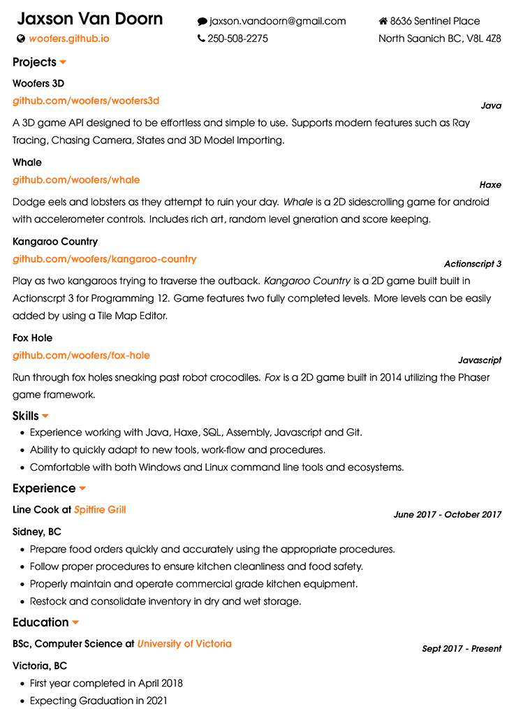

# Resume

**Source files for my resume using org-mode and LaTeX**

Uses *Emacs Org mode* with a custom *LaTeX* style sheet.  As a result it can be compiled in many formats such as *LaTeX PDF*, *Markdown* and *Bootstrap* HTML.

Requires enumitem package for lists and fontspec for icons.

Compiled with XeLaTeX.

# LaTeX PDF

# Markdown

  

# Projects

## [Woofers 3D](https://github.com/woofers/woofers3d)

### Java

*Woofers 3D* is a Java API that attempts to unify the features of Box2D and Bullet Physics into a simple yet capable package that can be run on nearly any device via LibGDX. Supports modern features such as ray tracing, chasing camera, game states and 3D model importing.

## [Whale](https://github.com/woofers/whale)

### Haxe

*Whale* is a 2D arcade style game built using HaxeFlixel. It features score tracking, level generation and responsive accelerometer controls. Game is fully completed and can be downloaded from the Google Play Store.

## [Kangaroo Country](https://github.com/woofers/kangaroo-country)

### Actionscript 3

*Kangaroo Country* is a 2D side-scrolling game built in Actionscrpt 3. Game features two fully completed levels where you play as two distinct characters in-order to solve platforming puzzles. As levels are imported from JSON based Tile Editor files, more levels can be dynamically added and created by others.

## [Fox Hole](https://github.com/woofers/fox-hole)

### Javascript

*Fox Hole* is a 2D proof of concept game built in Javascript with Phaser. You play as a fox sneaking past enemy crocodiles using underground tunnels in order to save your brother. It features checkpoints and enemies complete with very basic AI.

# Skills

-   Experience working with Java, Javascript, Actionscript 3, SQL, GraphQL and Git.
-   Ability to quickly adapt to new tools, work-flow and procedures.
-   Comfortable with both Windows, Linux and MacOS commandline tools and ecosystems.

# Experience

## Software Developer Co-op at [FTS Inc.](https://ftsinc.com)

### April 2018 - December 2018

**Victoria, BC**

-   Develop new features and services for web applications and APIs communicating with remote weather stations.
-   Configure, manage and version software projects using automated deployment tools.
-   Integrate Open Source tools used to configure IoT devices with existing software.

# Education

## BSc, Computer Science at [University of Victoria](https://uvic.ca)

### Sept 2017 - Present

**Victoria, BC**

-   Expecting Graduation in 2021
