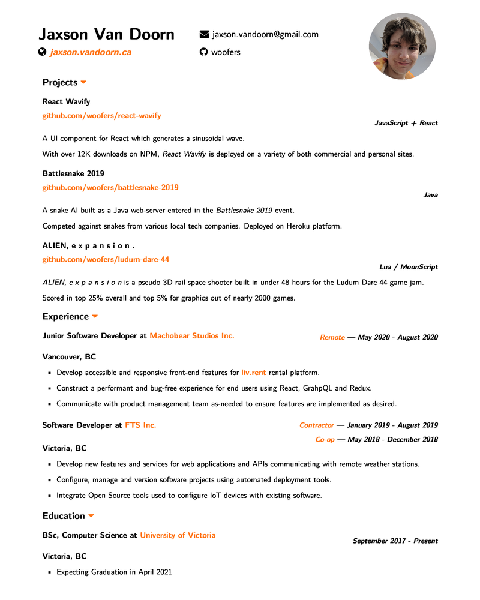

# Resume

**Source files for my resume using org-mode and LaTeX**

Uses *Emacs Org mode* with a custom *LaTeX* style sheet.  As a result it can be compiled in many formats such as *LaTeX PDF*, *Markdown* and *Bootstrap* HTML.

Requires enumitem package for lists and fontspec for icons.

Compiled with XeLaTeX.

# LaTeX PDF

